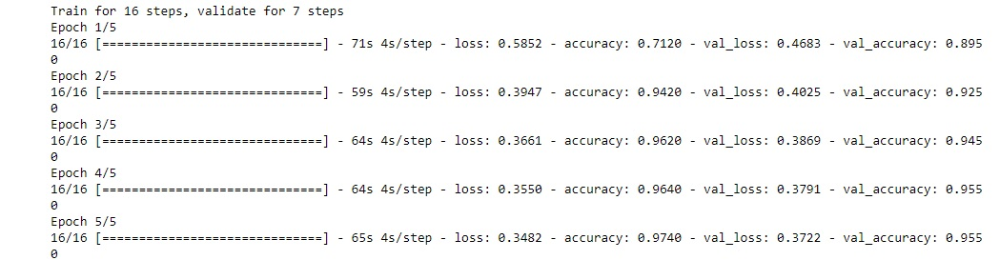

## 1. Introduction
This is a simple image classification project developed using Tensorflow and Keras, i used a model that was created by machine learning experts and that has already been trained on a large dataset (mobilenet). To avoid overfitting i perfomed multiple random operations on the train images (zoom, horizontal_flip ...) so that the model never train on the same image twice.

## 2. Training

