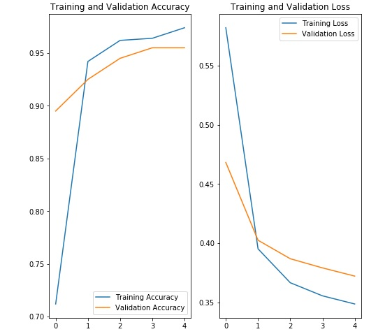
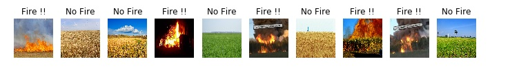
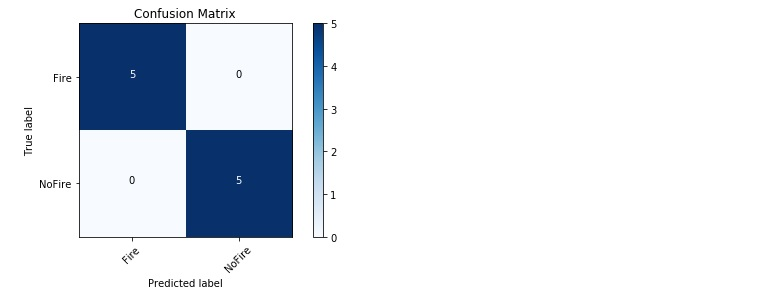

## 1. Introduction
This is a simple image classification project developed using Tensorflow and Keras, I used a model that was created by machine learning experts and that has already been trained on a large dataset (mobilenet). To avoid overfitting I perfomed multiple random operations on the training images (zoom, horizontal_flip ...) so that the model never sees the exact same image twice.

## 2. Training

## 3. Accuracy Curve

## 4. Predictions

## 5. Confusion Matrix

